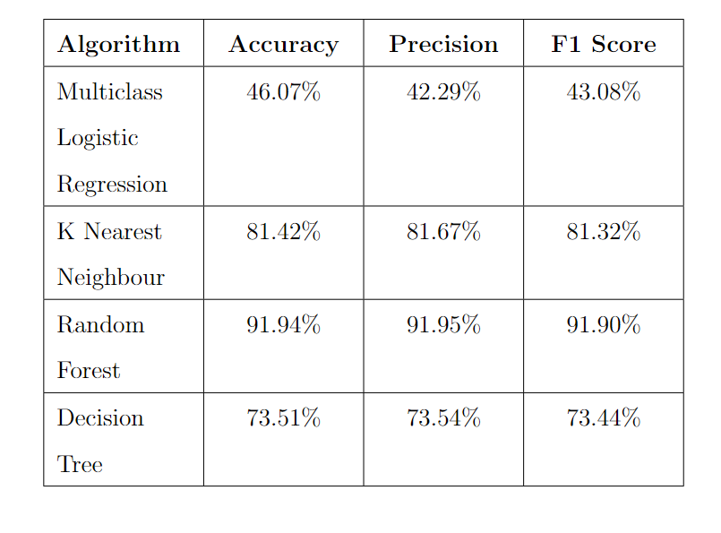
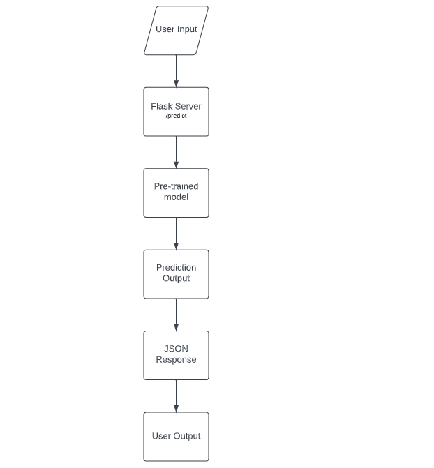

# Machine Learning Model

The dataset used consists of 12 features. Since a labelled dataset is used, a super- vised algorithm is needed. While implementing the proposed system many machine learning algorithms were tried. A comparison of all the tried-out machine-learning algorithms is shown in the below table.
From the table shown above it is clear that the Random Forest Algorithm has the highest accuracy of 89.84%. But the exported pickle file of this model comes to around 3 Gigabytes. Therefore the nearest next most accurate machine learning model with the size of the pickle file is less the KNN algorithm with an accuracy of 81.4232%.

[]

The flow diagram shows how the predict() function works in the Flask web framework to make predictions using a pre-trained model and return the output to the user in JSON format. The user provides input data to the Flask server. The Flask server receives the input data and calls the predict() function. The predict() function retrieves the input data from the user using the Flask request object. The input data is converted to a numpy array using the np.array() and reshape() methods. The pre-trained model makes a prediction using the input array using the model.predict() method. The prediction is returned to the Flask server as a single value. The predict() function returns the prediction to the Flask server in JSON format using the jsonify() function. The Flask server returns the JSON response to the user. This entire system is hosted in a cloud service provider. For the implementation of this project our system is deployed in Railway. Railway is a deployment platform where you can provision infrastructure, develop with that infrastructure locally, and then deploy to the cloud.

[]

---
title: Flask
description: A popular minimal server framework for Python
tags:
  - python
  - flask
---

# Setting Up the environment

This is a [Flask](https://flask.palletsprojects.com/en/1.1.x/) app that serves a simple JSON response.

## ✨ Features

- Python
- Flask

## 💁‍♀️ How to use

- Install Python requirements `pip install -r requirements.txt`
- Start the server for development `python3 main.py`
